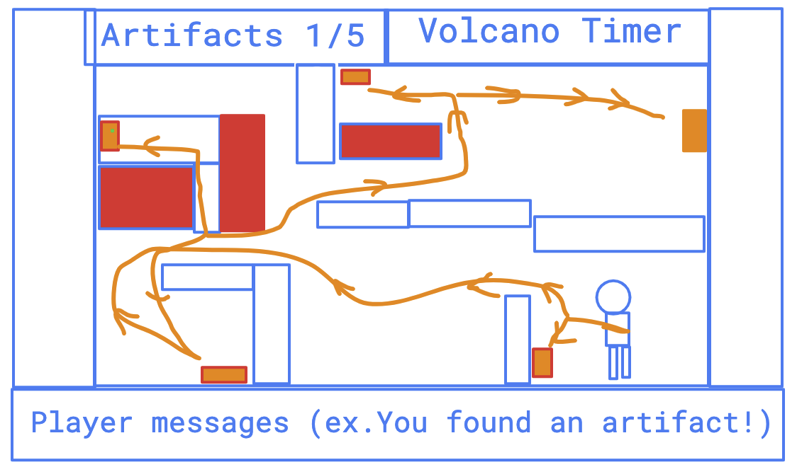

# archaeology-hunt

# Elevator Pitch
* My game will hide ancient artifacts throughout the page which the player has to find before a volcano erupts. If time runs out before the archaeologist gets to safety, the arhcaologist dies and the artifacts are destroyed.

# Using Canvas
* I will use canvas because I want the players to be mobile

Wireframe in folder

# MVP Goals
* Create a crawler game screen with canvas inside a grid-frame
* Render a start screen with game-play instructions and a timer
* Render game screen displaying the canvas, number of artifacts found
* Render an archaelogist character that can move freely using WASD keys
* Render lava and a few other death traps
* Render lava filling rooms at set timer intervals
* Render artifacts and tally artifacts found
* Create an artifact pick up key (space bar)

# Stretch Goals
* If character gets all artifacts before timer is finished, can move to next screen/level
* Make "doors open" when artifacts are found - (clear a block out of a wall)

# Any potential roadblocks
* Creating a screen that changes when you hit the edge of the canvas, and gives more running room

# Site Deployed at:
https://turtle-sprite.github.io/archaeology-hunt/

